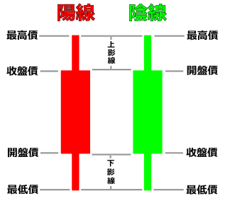
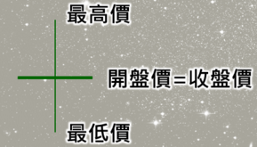
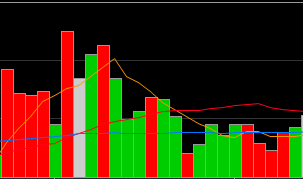
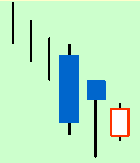
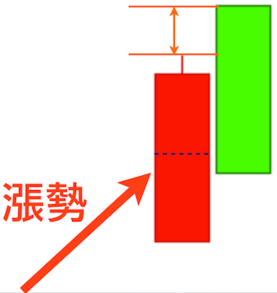
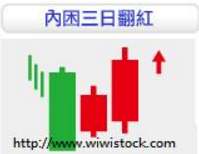
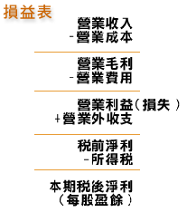

## 除權、除息
「除」是分配的意思。「除權」分配股票，「除息」分配現金。

例如假設鴻海今年發放現金股利1.5元，股票股利1元，假設你有一張鴻海（1000股）
現金股利1.5元: 每一股配發1.5元，1000股可得到1500元。
股票股利1元: 每張面額10元的股票能配1元的股票。所以你有1000股可以再得到100股。

## 加權指數
為了表達一群股票的整體狀況，用加權方式所算出來的總分，市值越高的公司，所佔的比重會越高。

## 市值
每股股價 x 總股數

## 月線
過去20天平均的收盤價（股市周末沒有營業，一個月差不多20天是有營業）
## 季線
過去60天平均的收盤價，季線不是一季（3個月）的平均收盤價。
## 年線
過去240天平均的收盤價

## 毛利
營業收入 - 營業成本
## 毛利率
(營業收入 - 營業成本)/營業收入
## 營業利益
營業收入 - 營業成本 - 營業費用
營業利益率: (營業收入 - 營業成本 - 營業費用)/營業收入
## 三大法人
指外資、投信、自營商。
## 外資
台灣以外的外國機構投資者  
## 投信
投資信託股份有限公司
## 自營商
政府認可的證券公司，證券公成用自己的錢直接和證交所買賣
  臺灣證券交易所可找到三大法人的買賣資訊
## K線
將股票一天當中的「開盤價」、「最高價」、「最低價」、「收盤價」表現出來。

## 槌子
跌勢裡的長下影線、短上影線。這種K線型狀像槌子。
## 吊人
 在漲勢中的槌子稱為吊人
## 十字線
 開盤價接近收盤價，有上影線、下影線
 
## 摜壓
 有人刻意大量賣出持股，而且價格越賣越低，希望股價快速跌落。
## 跳空
 假設有某支股票，昨天最高價500元，今天最低價550元，中間的501~549都沒有成交量，這中間的空白就是跳空

## 平盤價
 前一日的收盤價格

## 成交量顏色
當天收盤價高於昨天的收盤價，成交量為紅色
當天收盤價等於昨天的收盤價，成交量為白色
當天收盤價低於昨天的收盤價，成交量為綠色

## 回檔
 股價呈現不斷上漲趨勢，最終因股價上漲速度過快而反轉回跌到某一價位。
## 放空
 先借股票來賣，之後再買來還，在你認為股票未來會跌的情況下使用。
## 軋空
 股票上漲，使放空的人被迫回補而造成虧損
## 做多
發佈對公司或整體產業利多的消息，拉抬公司股票價格
## 做空
 發佈對公司不利的消息，導致股價下跌
## 多殺多
 手中有多單的交易者（持有股票，且認為未來股價會漲），看到行情不利時，大舉賣出的現象。
## 漲停
 一支股一天內最多只能漲昨天收盤價的7%
## 三河床
 三根K線組成，第一根是長黑線。第二天開盤稍微高，盤中創新低價，收盤則在最高價附近。第三天開低盤，但高於第二根K線的最低價，收盤則收高，但低於第二根K線的收盤價。

## 烏雲罩頂
 漲勢中出現紅K棒，隔天跳空開高後下殺，尾盤跌到前一根紅K實體的一半以下

## 三日內困三紅
 長黑K後出現一根小紅K，此紅K的高低點者被長黑K環抱在裡面，第三根長紅K破第一根黑K的高點

## 回檔
 在多頭市場裡，由於股價持續上漲而呈現暫時性的回跌，以調整價位，清理籌碼的現象。
## 反彈
 空頭市場中，由於股價連續下跌，而有調整價位，造成暫時性的回升，為大跌小漲的走勢

# 損益表
  以小明的麵包店為例：
###  營業收入
 從客人手上賺來的錢
###  營業成本
 取得銷售貨品時的成本，如奶油、麵粉、巧克力的花費等
###  營業費用
 指企業為銷售或管理活動而發生的各項支出，如員工薪水、店租等
###  營業外收入
 小明在閒閒沒客人時，把錢拿去投資股票或其它投資，結果幸運的賺到錢，這筆錢就是「營業外收入」

  營業收入 - 營業成本 = 營業毛利

  營業毛利 - 營業費用 = 營業利益

假設小明開了一家麵店，每個月賣麵收入100元，買麵粉材料花30元，水電費10元，顧了月薪20元的幫手。
  阿田的
  毛利=100-30=70元
  毛利率=(100-30)/100=70%
  營業利益=100-30-10-20=40元
  營業利益率=(100-30-10-20)/100=40%
